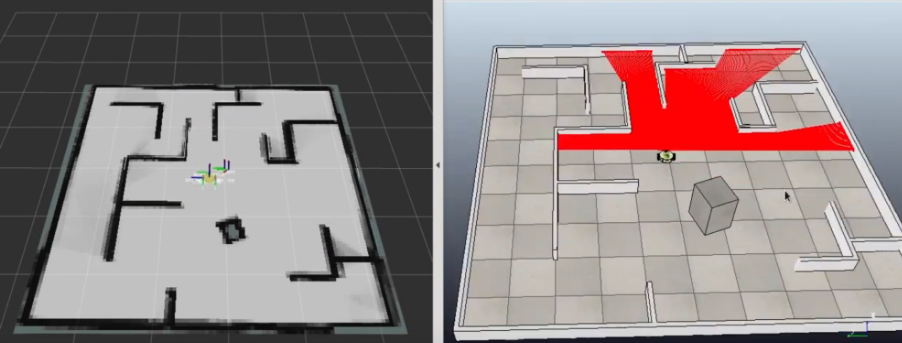

# cartographer_gmapping
This package contains comparison between the mapping algorithms available in ros : Gmapping and Cartographer using pocker_bot in V-REP.

Click the image below to view the video of implementation:

Clone `pocker_bot_vrep_description` to your `catkin_ws`.

Open V-REP with `mapping_scene.ttt`. Make sure you run `roscore` before opening V-REP to load Ros Interface.

To run cartographer, run cartographer_mapping.launch by `roslaunch cartographer_mapping cartographer_mapping.launch`

Publications:
+ /map
+ /submap_list

Change `cartographer.lua` in configuration_files folder to tune the parameter based on your platform.

To run gmapping, run gmapping_mapping.launch by `roslaunch cartographer_mapping gmapping_mapping.launch`

Publications:
+ /map
+ /map_metadata

Change parameters for slam_gmapping node in gmapping_mapping.launch to tune for your platform.

