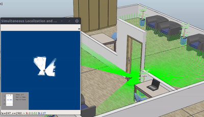

# Simultaneous Localization and Mapping in V-REP

A demonstration of Random Mutation Hill-Climbing SLAM in Vrep and python.

Requirements:
    numpy, opencv-python

## Usage

Run the demo in a room environment using Pioneer robot:

    python run.py 

Credits:

1. [V-Rep](http://www.coppeliarobotics.com/downloads.html) - Simulation software by Copellia Robotics
2. [breezyslam](https://github.com/simondlevy/BreezySLAM) - Python library for SLAM

