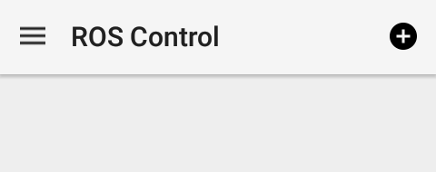
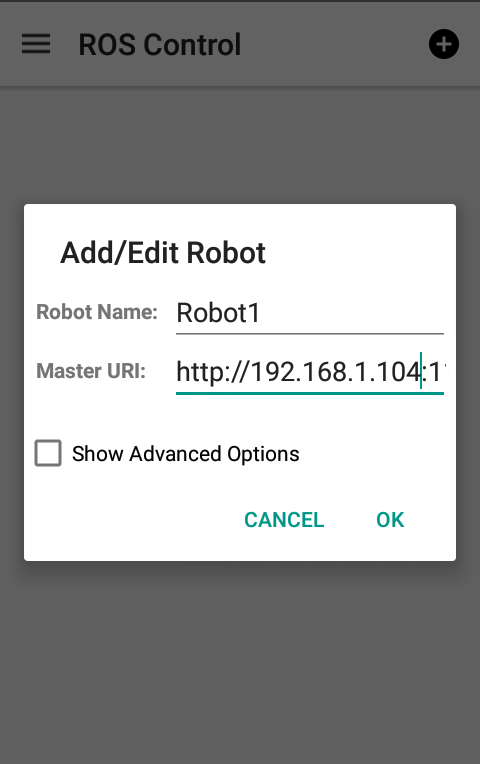
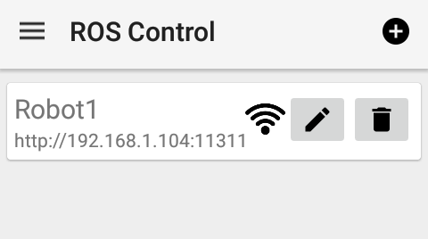
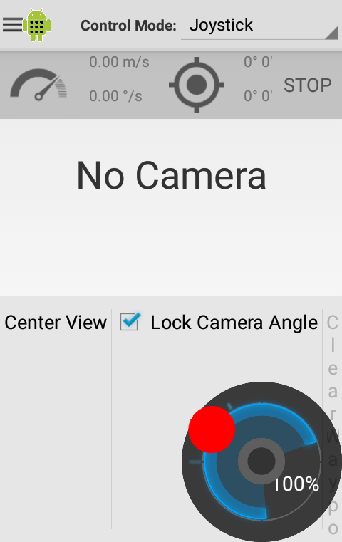

# Teleoperate Pioneer P3dx on VREP using ROS and Android App

<!--  -->
<!-- Build 2D grid map with laserscan data avia rviz -->
* Control the mobile robot in the `vrep` simulation environment with keyboard
* Teleoperate the robot using an [ROS CONTROL](https://play.google.com/store/apps/details?id=com.robotca.ControlApp) (Android APP)

<!--  -->

## SETUP
#### ROS install and catkin
1. Install catkin: http://wiki.ros.org/catkin
2. Install ROS: http://wiki.ros.org/ROS/Installation
3. Configure and create catkin workspace
```
$ echo "source /opt/ros/kinetic/setup.bash" >> ~/.bashrc
$ source ~/.bashrc
$ mkdir -p ~/teleop_pioneer_slam/src
$ cd ~/teleop_pioneer_slam/
$ catkin_make
$ echo "source ~/teleop_pioneer_slam/devel/setup.bash" >> ~/.bashrc
$ source ~/.bashrc
```
#### Install V-REP
1. Dowload V-REP: http://www.coppeliarobotics.com/downloads.html
```
$ cp V-REP_PRO_EDU_V3_4_0_Linux.tar.gz ~
$ tar -zvxf ~/V-REP_PRO_EDU_V3_6_0_Linux.tar.gz
$ mkdir ~/V-REP
$ mv ~/V-REP_PRO_EDU_V3_6_0_Linux ~/V-REP
```
#### Load RosInterface and Some Packages
* Copy everything in this repo to `~/teleop_pioneer_slam/`
```
$ cd ~/teleop_pioneer_slam/
$ catkin build
$ source ~/.bashrc
```
* Copy /RosInterface/libv_repExtRosInterface.so
```
$ cd teleop_pioneer_slam/RosInterface
$ cp libv_repExtRosInterface.so  ~/V-REP
```

## RUN

1. open one terminal and run `$ roscore`

2. open another terminal and run `$ . ~/V-REP/vrep.sh`

>  Please pay attention to these message and if you see

```
Plugin ’RosInterface’: loading...
Plugin ’RosInterface’: load succeeded.
```

3. open `slam_peoneer_p3dx_2.ttt` in vrep's scene and press the start bottom

4. Download and install the [Android APP](https://play.google.com/store/apps/details?id=com.robotca.ControlApp)
used to control the robot.

5. Enter the app and select the **+** button to add a new robot.



5. Enter the Robot Name and the Master URI. Change localhost to the computer ip that is running roscore. For example 192.168.1.104. Then select OK.



6. Select the recently added robot.



7. On a new terminal run the subscriber_teleop.py

```
$ rosrun external_teleop subscriber_teleop.py
```

8. Control the robot using the joystick from the app


